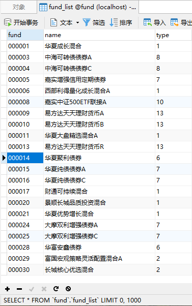
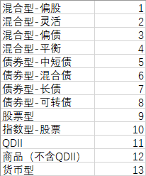
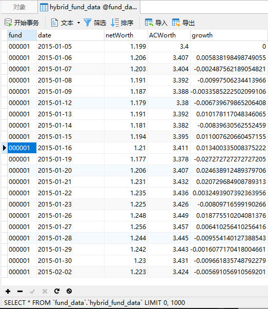

# tiantianfund_Crawler

通过天天基金网数据接口下载/更新基金数据，并经过数据清洗进入到 mysql 中
加入多线程与代理池 加快效率

主要使用的接口地址：

1、获取市场上基金名称和类型：<http://fund.eastmoney.com/js/fundcode_search.js>

2、获取基金详细数据：<http://fund.eastmoney.com/pingzhongdata/000001.js>

## 确定环境中存在以下库

```shell
pip install -r requirements
```

### 确定 mysql 已经安装

### 生成 fund_list 数据表

fund_list 数据表中包括基金代码、交易日期、单位净值、累计净值、以及日增长率

初次运行需要在生成 fund_list 数据表，方便之后根据基金类型或基金代码下载

```
python fund_list_down.py --account root --password 123456 --host localhost --post 3306 --database fund
```

--account mysql 账号名称 --password mysql 密码 --host mysql 地址 --post mysql 端口 --database mysql 数据库名称

生成的 fund_list 数据表如下所示



其中基金类型与数字代号（type）对应关系见 fund-type.xlsx



### 生成 fund_data 数据表

初次运行必须是 update==False，下载全部基金数据

```shell
python fund_data_down.py --account root --password 123456 --host localhost --post 3306 --database fund --update False
```

update==True 则进入更新模式，更新 fund_data_all 中的数据

```shell
python fund_data_down.py --account root --password 123456 --host localhost --post 3306 --database fund --update True
```

生成的 fund_date 数据表如下所示



其中该程序总共会生成六张数据表，不同基金类型分别对应的英文为：

```
names = ['hybrid', 'bond', 'equity', 'index', 'qdii', 'commodity']  # [混合，债券，股票，指数，QDII，商品（非QDII）]
```

同时该程序会在根目录下生成对应的六个 fund_data_error_list.txt，用于记录当次程序无法下载的基金代码
